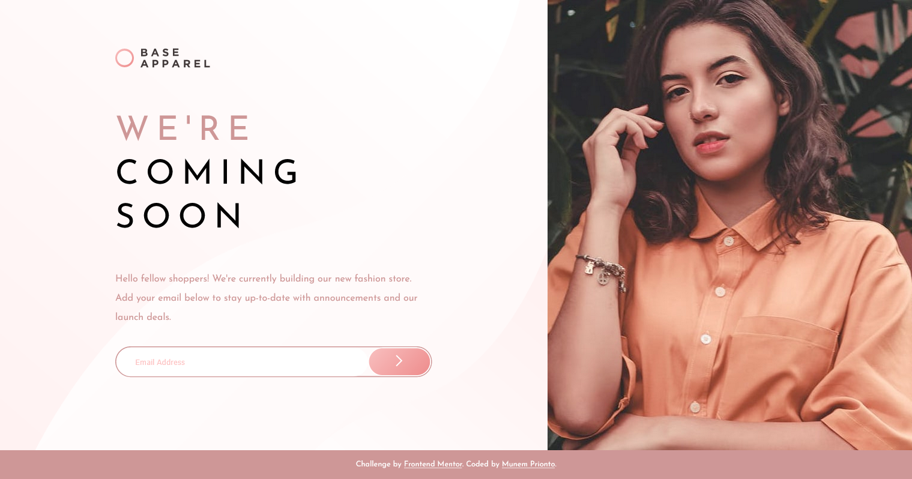

# Frontend Mentor - Base Apparel coming soon page solution

This is a solution to the [Base Apparel coming soon page challenge on Frontend Mentor](https://www.frontendmentor.io/challenges/base-apparel-coming-soon-page-5d46b47f8db8a7063f9331a0). Frontend Mentor challenges help you improve your coding skills by building realistic projects. 

## Table of contents

- [Overview](#overview)
  - [Screenshot](#screenshot)
  - [Links](#links)
  - [Built with](#built-with)
  - [Author](#author)

## Overview

### Screenshot

### Links

- [Solution](https://github.com/Munem-Prionto/frontendmentor.io/tree/main/base-apparel-coming-soon)
- [Live](https://base-apparel-coming-soon-mp.netlify.app/)

### Built with

- HTML5
- CSS 3
- JavaScript

## Author

- Website - [Munem Prionto](https://munemprionto.netlify.app)
- Frontend Mentor - [@Munem-Prionto](https://www.frontendmentor.io/profile/Munem-Prionto)

