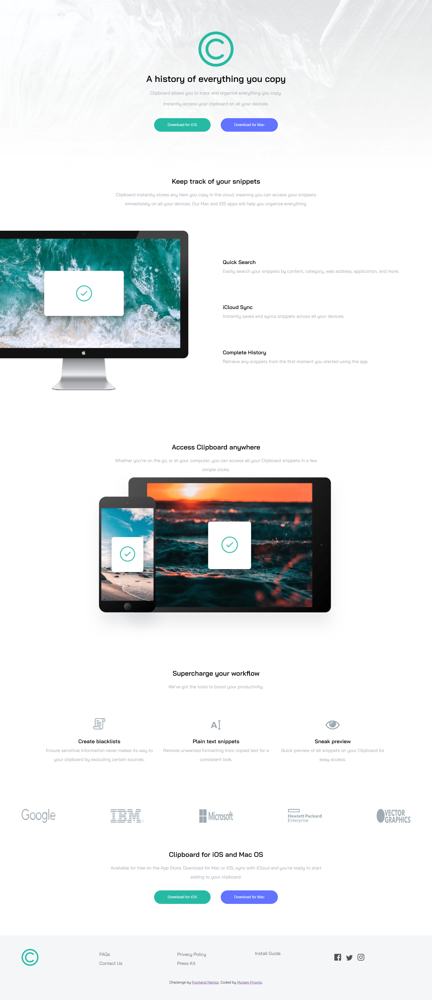

# Frontend Mentor - Clipboard landing page solution

This is a solution to the [Clipboard landing page challenge on Frontend Mentor](https://www.frontendmentor.io/challenges/clipboard-landing-page-5cc9bccd6c4c91111378ecb9). Frontend Mentor challenges help you improve your coding skills by building realistic projects. 

## Table of contents

- [Overview](#overview)
  - [Screenshot](#screenshot)
  - [Links](#links)
  - [Built with](#built-with)
  - [Author](#author)

## Overview

### Screenshot

### Links

- [Solution](https://github.com/Munem-Prionto/frontendmentor.io/tree/main/clipboard-landing-page)
- [Live](https://clipboard-landing-page-mp.netlify.app/)

### Built with

- HTML5
- CSS 3

## Author

- Website - [Munem Prionto](https://munemprionto.netlify.app)
- Frontend Mentor - [@Munem-Prionto](https://www.frontendmentor.io/profile/Munem-Prionto)