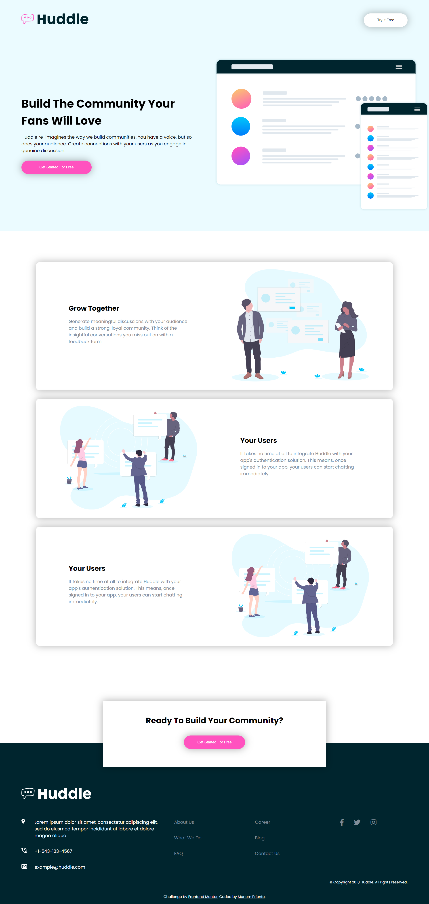

# Frontend Mentor - Huddle landing page with alternating feature blocks solution

This is a solution to the [Huddle landing page with alternating feature blocks challenge on Frontend Mentor](https://www.frontendmentor.io/challenges/huddle-landing-page-with-alternating-feature-blocks-5ca5f5981e82137ec91a5100). Frontend Mentor challenges help you improve your coding skills by building realistic projects. 

## Table of contents

- [Overview](#overview)
  - [Screenshot](#screenshot)
  - [Links](#links)
  - [Built with](#built-with)
  - [Author](#author)

## Overview

### Screenshot

### Links

- [Solution](https://github.com/Munem-Prionto/frontendmentor.io/tree/main/huddle-landing-page-with-alternating-feature-blocks-master)
- [Live](https://huddle-landing-page-with-alternating-feature-blocks-master-mp.netlify.app/)

### Built with

- HTML5
- CSS 3

## Author

- Website - [Munem Prionto](https://munemprionto.netlify.app)
- Frontend Mentor - [@Munem-Prionto](https://www.frontendmentor.io/profile/Munem-Prionto)