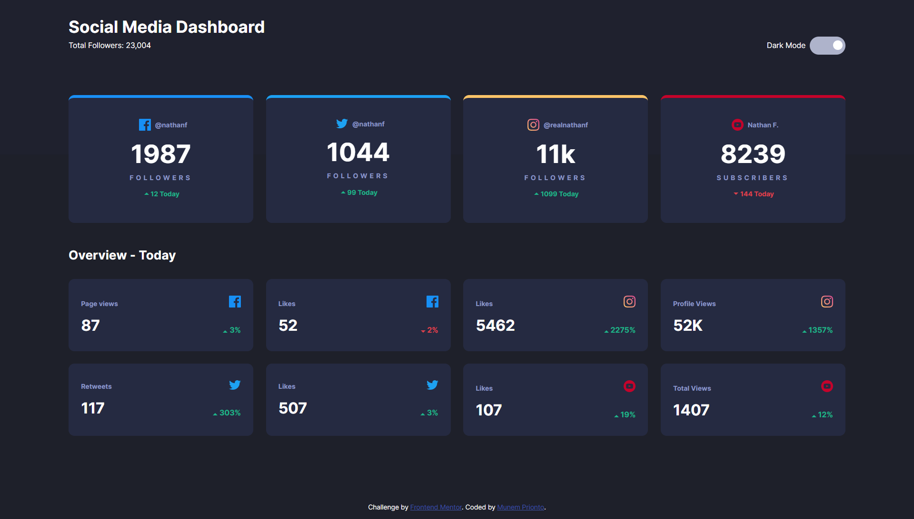

# Frontend Mentor - Social media dashboard with theme switcher solution

This is a solution to the [Social media dashboard with theme switcher challenge on Frontend Mentor](https://www.frontendmentor.io/challenges/social-media-dashboard-with-theme-switcher-6oY8ozp_H). Frontend Mentor challenges help you improve your coding skills by building realistic projects. 

## Table of contents

- [Overview](#overview)
  - [The challenge](#the-challenge)
  - [Screenshot](#screenshot)
  - [Links](#links)
  - [Built with](#built-with)
  - [Author](#author)

## Overview

### The challenge

Users should be able to:

- View the optimal layout depending on their device's screen size
- See hover states for interactive elements

### Screenshot

### Links

- [Solution](https://github.com/Munem-Prionto/frontendmentor.io/tree/main/social-media-dashboard-with-theme-switcher)
- [Live](https://social-media-dashboard-with-theme-switcher-mp.netlify.app/)

### Built with

- HTML5
- CSS 3
- JavaScript

## Author

- Website - [Munem Prionto](https://munemprionto.netlify.app)
- Frontend Mentor - [@Munem-Prionto](https://www.frontendmentor.io/profile/Munem-Prionto)
